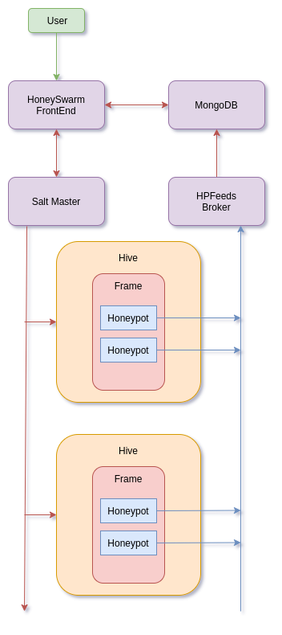

# honeyswarm
HoneyPot Orchestration

# What is it?

Docs available - https://honeyswarm.readthedocs.io/en/latest/honeypots.html

# Install

- Copy honeyswarm_template.env to honeyswarm.env
- Make your changes
- Run `docker-compose up`
- Connect to http://honeyswarmip/install
- Finish the install.