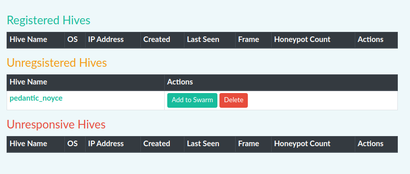
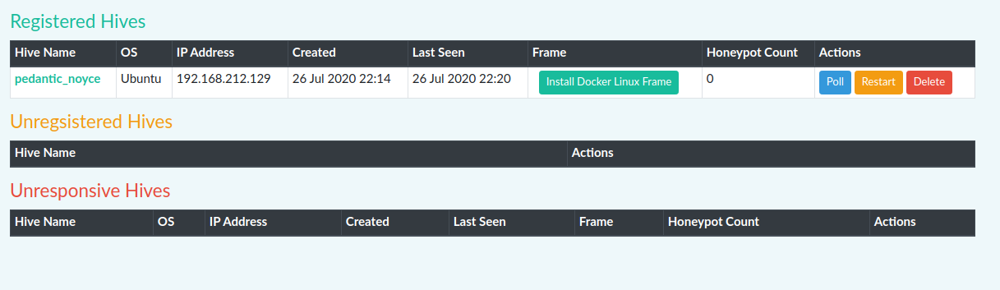

Hives
=====

What is a Hive
--------------
A Hive is a host device that is capable of running one or more honeypots. A hive can be a virtual machine a physical macine or an Amazon instance.

There are a few requirements that a hive must meet in order to deploy and run honeypots. 

- Can connect to the internet. 
- Can connect to the HoneySwarm controller
- Able to install and run docker containers
- Supports python >=3.7

Create a Hive
-------------
The first step is to initialise the Hive Host. We do this by installing a Salt Minion with some custom parameters. You can use the follwing examples to init a Linux or Windows Host replacing the IP address. 

``curl -H "Authorization: APITOKEN" http://HONEYSWARMIP:8080/hives/api/hive/register/linux | sudo sh``

These command lines are also displayed in HoneySwarm on the hives page with your current API token. 

This should install the base and register the hive with HoneySwarm. The next step is to approve the registration

Add hive to HoneySwarm
----------------------

Once a Hive has been initialised we need to approve it in to the swarm. This prevents rogue hosts from connecting to us. You will only see the dropdown action once the Minion has started and sent its key to the master.
Once availiable Just select the 'Add to swarm' button under actions

After the Hive is authenticated to the swarm you need to add a Frame. For more details on Frames see the Frames page. 

All availaible frames will be displayed for Hives. To install a Frame click the Install button

Frame installation can take several minutes depending on OS and internet speeds. You can track the installation under the /jobs page

.. image:: images/HoneySwarm_jobs.png
   :alt: Jobs

With a frame installed we can now deploy some honeypots. 