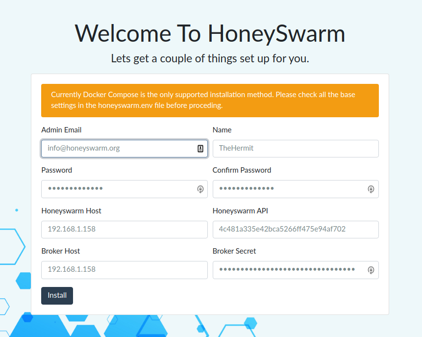

Installation
============

The officially supported installation process is to use the docker-compose that is shipped with the repo. 
Installing in a method other than docker-compose is left as an exercise to the user. Read the compose and the docker files for each container 
should give you a headstart. 

Docker and Compose
------------------

Install Docker and docker-compose using the offical guides at https://docs.docker.com/get-docker/

HoneySwarm
----------

If you want to run the latest stable release use the following docker-compose file and pin a release tag

.. code-block:: yaml

   version: '3.7'
   services:
   honeyswarm:
      image: honeyswarm/honeyswarm
      container_name: honeyswarm
      env_file:
         - honeyswarm.env
      ports:
         - "8080:8080"
      networks:
         honeynet:
         ipv4_address: 10.1.0.101
      volumes:
         - "honeyswarmStates:/opt/honeystates/salt:rw"
      depends_on: 
         - mongoserver
         - saltmaster
   mongoserver:
      image: mongo:latest
      container_name: honeyswarm_db
      env_file:
         - honeyswarm.env
      ports:
         - '27017:27017'
      networks:
         honeynet:
         ipv4_address: 10.1.0.102
      volumes:
         - "honeyswarmDB:/data/db"
   saltmaster:
      image: "saltstack/salt:latest"
      container_name: honeyswarm_saltstack
      env_file:
         - honeyswarm.env
      ports:
         - "8000:8000"
         - "4505:4505"
         - "4506:4506"
      networks:
         honeynet:
         ipv4_address: 10.1.0.103
      volumes:
         - "honeyswarmPKI:/etc/salt/pki:rw"
         - "honeyswarmStates:/srv/salt:rw"
   hpfeeds-broker:
      image: honeyswarm/honeyswarm_broker
      container_name: honeyswarm_broker
      ports:
      - "0.0.0.0:10000:10000"
      networks:
         honeynet:
         ipv4_address: 10.1.0.104
      env_file:
         - honeyswarm.env
      depends_on: 
         - mongoserver

   networks:
   honeynet:
      driver: bridge
      ipam:
         driver: default
         config:
         - subnet: 10.1.0.0/24

   volumes:
   honeyswarmDB:
   honeyswarmPKI:
   honeyswarmStates:

If you prefer a development version then ``git clone git@github.com:honeyswarm/honeyswarm.git``

Create a docker-compose.yml file on the host you want to operate as the HoneySwarm Controller. 
Add the contents of the compose file from above. 

Create a honeyswarm.env file in the same directory as the docker-compose and add the following content. The latest version can be found in the git repo. 

.. code-block:: sh

   # Salt Master details
   SALT_USERNAME=salt
   SALT_SHARED_SECRET=supersecretsaltstackmasterstring
   SALT_HOST=https://127.0.0.1:8000

   # Flask Shell
   FLASK_APP=honeyswarm.py
   PYTHONPATH=/opt/
   SESSION_SECRET=MuhktUNBDthagZkY477ZWcXfM41x5dRuao8eEXZK

   # Mongo Details
   MONGODB_HOST=127.0.0.1
   MONGODB_PORT=27017
   MONGODB_USERNAME=admin
   MONGODB_PASSWORD=admin
   MONGODB_AUTH_SOURCE=admin
   MONGODB_DATABASE=honeyswarm
   MONGO_INITDB_ROOT_USERNAME=admin
   MONGO_INITDB_ROOT_PASSWORD=admin

   # HPFeeds
   WAIT_HOSTS=127.0.0.1:27017

Configuration
-------------

Copy ``honeyswarm_template.env`` to ``honeyswarm.env`` and change the default passwords and tokens as per the list below.

- SALT_SHARED_SECRET
- MONGODB_USERNAME and MONGO_INITDB_ROOT_USERNAME
- MONGODB_PASSWORD and MONGO_INITDB_ROOT_PASSWORD

Please leave all the HOST names and ports as they are pre configured. 

If you wish to change the external HTTP port from 8080 to something of your choice edit the docker-compose.yml file. 

Once you have made your changes you will need to start the application and complete the first time setup.

First Time Setup
----------------

Start Honeyswarm using the command ``docker-compose up``. Refer to the Starting section for more details. 

The first start will download all the required docker images and configure them as per the .env file. 

Once you start your HoneySwarm instance for the first time you will need to run the initial installation. 
To start the install visit http://HONEYSWARMIP:8080/install

You should be presented with an installation form. 

Fill all the required fields.

- Honeyswarm Host: This should be set to an IP address that your honeypot hosts (Hives) can access. 
- Honeyswarm API: This will autofil with a randomly generated API Key, but you can change it. This is the key that will be used to run the initial Hive setup
- BrokerHost: This is the HPFeeds Broker IP, if your using the default installation this should be set to match the HoneySwarm Host fields
- Broker Secret: This is the main auth key that will be used to Subscribe to ALL incoming honeypot Events. 

As part of the installation HoneySwarm will download and install all the available frames and honeypots.

Starting
========
All commands must be executed from the honeyswarm directory.

To start the application in the background enter ``docker-compose up -d`` in a terminal.
To start the application in the forground with visible logging enter ``docker-compose up`` in a terminal.

Stopping
========
All commands must be executed from the honeyswarm directory.

``docker-compose down``

Backup / Restore
================

Volumes
-------

To maintain persistance of data HoneySwarm uses docker volumes. As long as you do not prune or destory these volumes you 
can start, stop and upgrade your HoneySwarm containers without losing data. 

Backup
------
For details on backing up or restoring docker volumes please refer to the docker documentation.

Update
======

If your using docker-compose you can update your installation by following these steps. 

**Note** This will take your hpfeeds broker offline for a few minutes and you will not store any incoming events. 

- ``cd`` to the honeyswarm directory
- ``docker-compose pull``
- ``docker-compose up --force-recreate --build -d``
